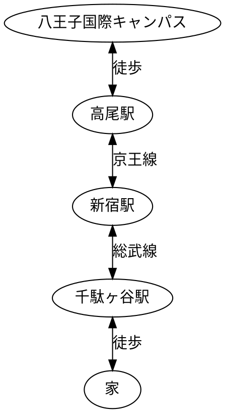

# 石亀　敬梧の通学経路

[メンバー表に戻る](member.md#メンバー表)

```graphviz
digraph {
    edge [dir=both]

    // 例
    八王子国際キャンパス -> 高尾駅 [label=徒歩]
    高尾駅 -> 新宿駅 [label=京王線]
    新宿駅 -> 千駄ヶ谷駅 [label=総武線]
    千駄ヶ谷駅 -> 家 [label=徒歩]
}
```
